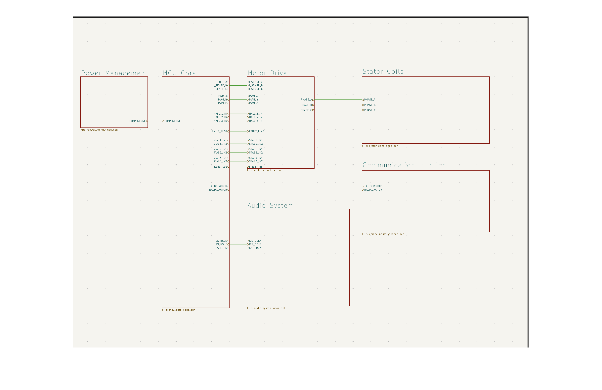
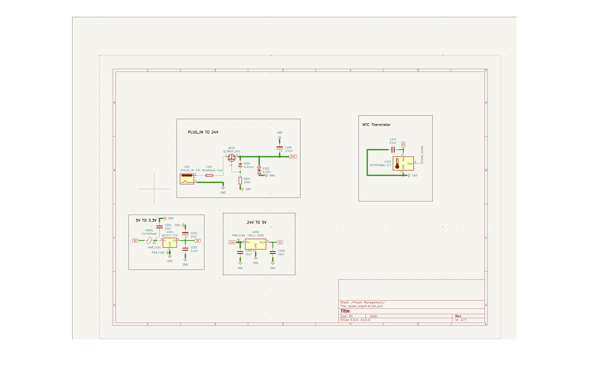
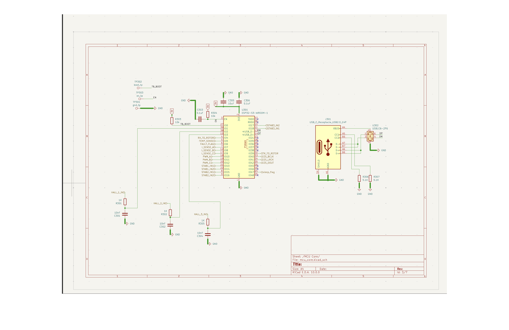
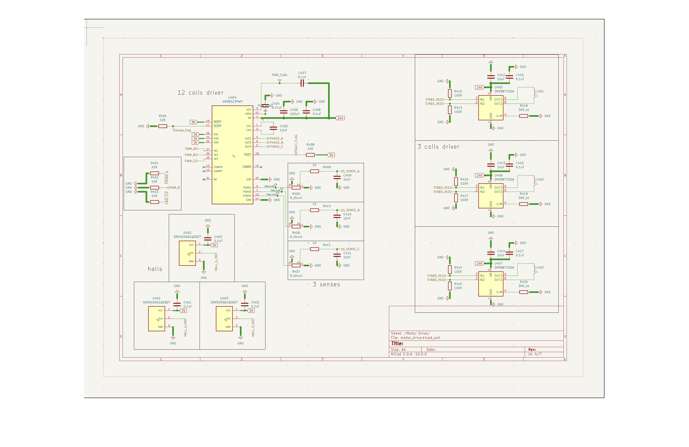
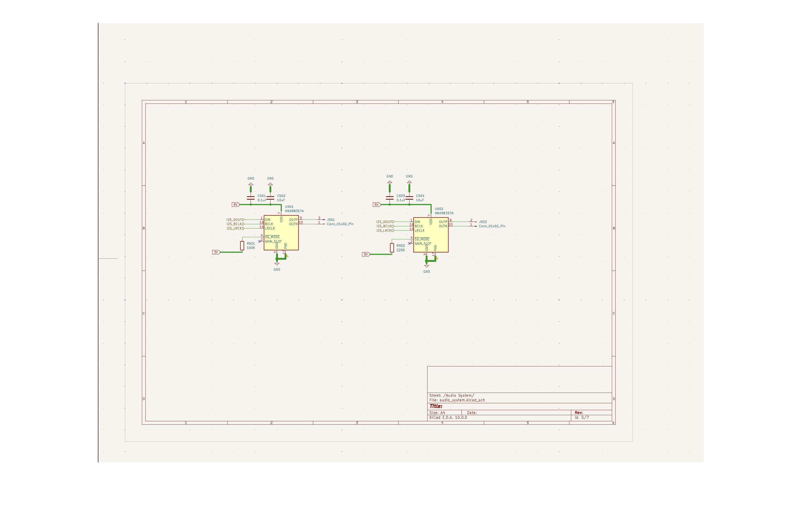
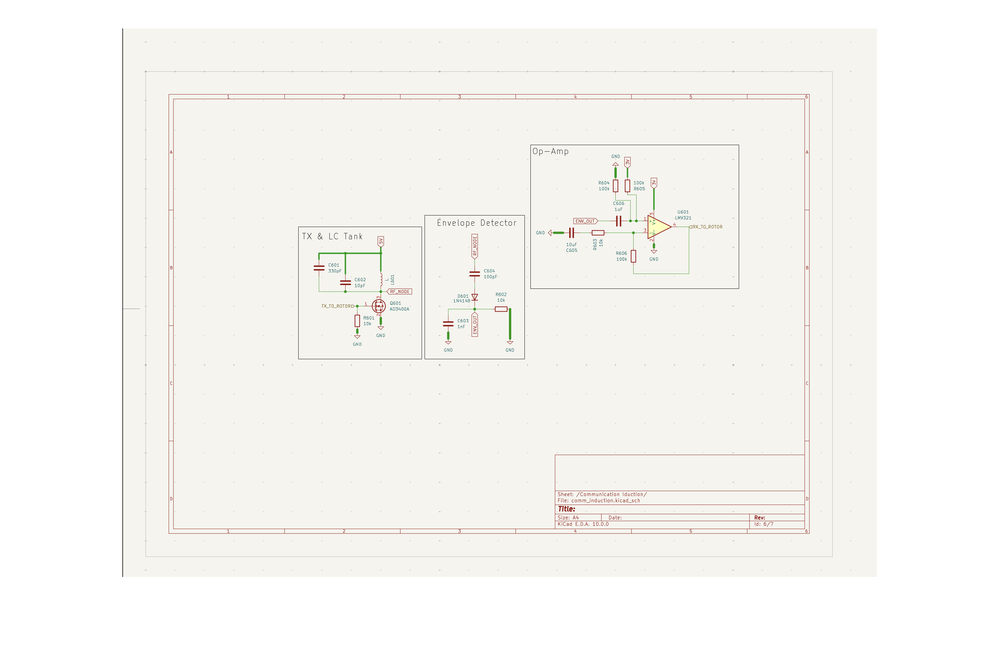
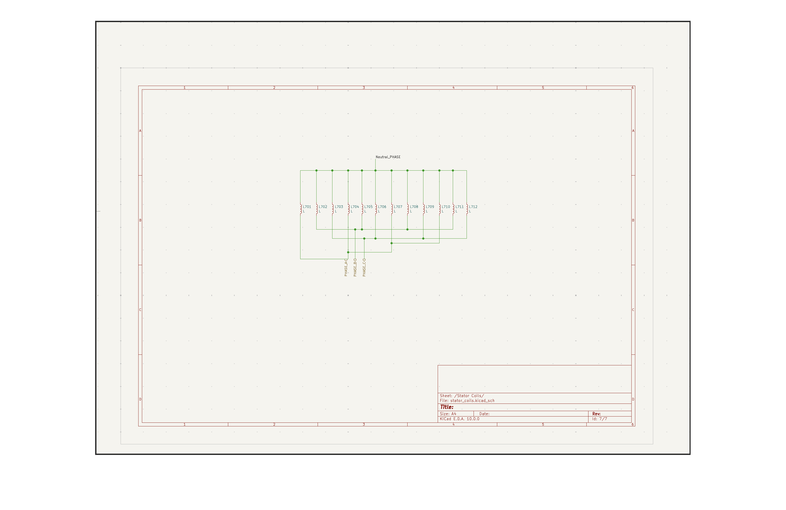

# SoundBoard

This directory contains a collection of soundboard images.

## Files

| File | Description |
|------|-------------|
|  | Root Page |
|  | Power Page |
|  | MCU Page |
|  | Motor Page |
|  | Audio Page |
|  | Communication Page |
|  | Stator Page |

## Usage

These PNG files are used as visual triggers for the soundboard system. Each image (1-7) corresponds to a specific sound or action in the audio processing pipeline.

## Related Files

- `coilmaker.py` - Main soundboard processing script
- `images/` - Directory containing image assets
